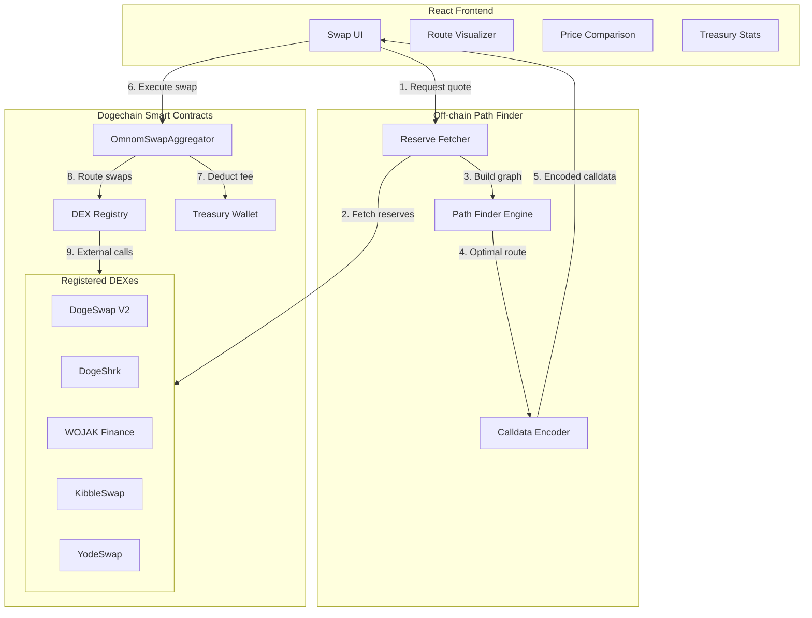
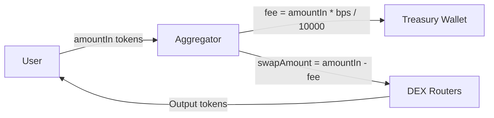
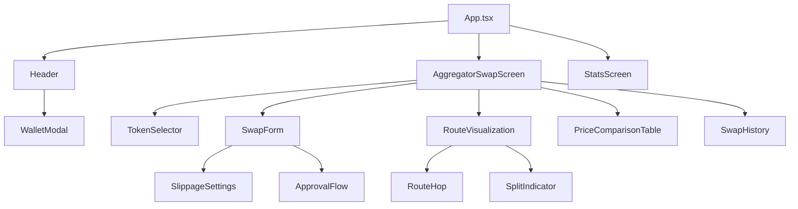
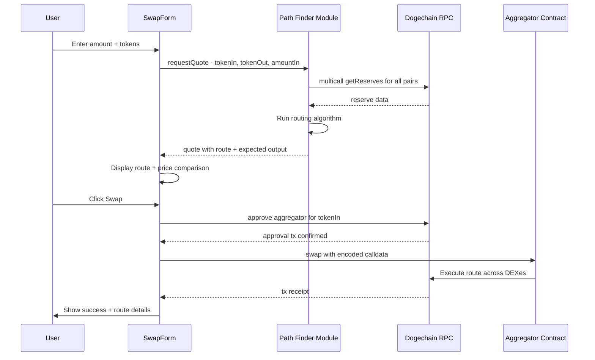

# OmnomSwap Aggregator — Architecture Document

> **Status:** Draft  
> **Date:** 2026-04-15  
> **Network:** Dogechain (Chain ID 2000)  
> **Stack:** Solidity 0.8.x · TypeScript · React 19 · wagmi · viem

---

## 1. System Overview

OmnomSwap is a DEX aggregator that scans all active UniswapV2-fork DEXes on Dogechain to find the optimal swap price. It consists of three layers:

1. **On-chain Aggregator Contract** — receives pre-computed routes from the off-chain pathfinder and atomically executes multi-DEX, multi-hop swaps with protocol fee deduction.
2. **Off-chain Path Finder** — a TypeScript module that fetches pair reserves via RPC, builds a liquidity graph, and computes optimal routing using modified Dijkstra/Bellman-Ford algorithms.
3. **Frontend Dashboard** — a React UI that presents the swap interface, route visualization, price comparisons, and treasury stats.



### Data Flow

1. User enters swap parameters in the frontend.
2. Frontend calls the Path Finder with `tokenIn`, `tokenOut`, `amountIn`.
3. Reserve Fetcher multicalls all registered pair contracts to get current reserves.
4. Path Finder Engine builds a weighted directed graph and finds the best route.
5. Calldata Encoder produces the encoded function call for the aggregator contract.
6. Frontend submits the transaction to `OmnomSwapAggregator.swap()`.
7. Aggregator deducts the protocol fee and sends it to the Treasury.
8. Aggregator iterates through the route, calling each DEX router via external calls.
9. Tokens are delivered to the user; slippage protection is enforced throughout.

---

## 2. Smart Contract Design

### 2.1 OmnomSwapAggregator.sol

The aggregator is an ownable contract that executes pre-computed swap routes. It does **not** perform on-chain path finding — all routing logic lives off-chain to save gas and maximize flexibility.

#### State Variables

| Variable | Type | Description |
|---|---|---|
| `owner` | `address` | Contract owner — can configure fees, treasury, and DEX registry |
| `treasury` | `address` | Recipient of protocol fees |
| `protocolFeeBps` | `uint16` | Fee in basis points — e.g. 10 = 0.1%, max 50 = 0.5% |
| `dexRouters` | `mapping of address to bool` | Whitelist of approved DEX router addresses |
| `paused` | `bool` | Emergency pause flag |

#### Data Structures

```
struct SwapStep {
    address router;      // DEX router to call
    address[] path;      // Token path for this step — e.g. [tokenA, tokenB]
    uint256 amountIn;    // Input amount for this step
    uint256 amountOutMin;// Minimum output — slippage protection
}

struct SwapRequest {
    address tokenIn;         // Token the user sells
    address tokenOut;        // Token the user buys
    uint256 amountIn;        // Total input amount
    uint256 minAmountOut;    // Overall minimum output — user slippage tolerance
    SwapStep[] steps;        // Ordered list of swap steps
    uint256 deadline;        // Transaction deadline timestamp
}
```

#### Function Signatures

```
// ── User Functions ──

function swap(SwapRequest calldata request)
    external
    returns (uint256 totalAmountOut)

function swapWithPermit(
    SwapRequest calldata request,
    uint256 permitAmount,
    uint256 deadline,
    uint8 v, bytes32 r, bytes32 s
) external returns (uint256 totalAmountOut)

// ── View Functions ──

function getProtocolFee() external view returns (uint16)
function getTreasury() external view returns (address)
function isDexRegistered(address router) external view returns (bool)

// ── Admin Functions ──

function registerDex(address router) external onlyOwner
function deregisterDex(address router) external onlyOwner
function setProtocolFee(uint16 bps) external onlyOwner
function setTreasury(address treasury_) external onlyOwner
function pause() external onlyOwner
function unpause() external onlyOwner
function rescueTokens(address token, uint256 amount) external onlyOwner
```

#### Swap Execution Logic

```
1.  require(!paused, "Aggregator paused")
2.  require(block.timestamp <= request.deadline, "Expired")
3.  require(protocolFeeBps <= 500, "Fee too high")  // invariant check

4.  Transfer tokenIn from user to this contract (via transferFrom)

5.  fee = amountIn * protocolFeeBps / 10000
6.  swapAmount = amountIn - fee

7.  Transfer fee to treasury in tokenIn

8.  For each step in request.steps:
        require(dexRouters[step.router], "Unregistered DEX")
        
        If first step or intermediate:
            Approve step.router to spend the input token for step.amountIn
        
        Encode swapExactTokensForTokens(step.amountIn, step.amountOutMin, step.path, address(this), request.deadline)
        Call step.router with encoded calldata
        Verify return amount >= step.amountOutMin

9.  totalAmountOut = final output from last step
10. require(totalAmountOut >= request.minAmountOut, "Slippage exceeded")

11. Transfer tokenOut to user
12. Emit SwapExecuted event
```

#### Events

```
event SwapExecuted(
    address indexed user,
    address indexed tokenIn,
    address indexed tokenOut,
    uint256 amountIn,
    uint256 amountOut,
    uint256 fee,
    uint16 feeBps
)

event DexRegistered(address indexed router)
event DexDeregistered(address indexed router)
event ProtocolFeeUpdated(uint16 oldBps, uint16 newBps)
event TreasuryUpdated(address indexed oldTreasury, address indexed newTreasury)
event Paused()
event Unpaused()
```

### 2.2 Security Considerations

| Concern | Mitigation |
|---|---|
| Reentrancy | Use OpenZeppelin `ReentrancyGuard` — all external calls to DEX routers happen after state updates. Follow checks-effects-interactions pattern. |
| Slippage | Two layers: per-step `amountOutMin` and overall `minAmountOut`. Both enforced. |
| Deadline | `require(block.timestamp <= deadline)` prevents pending transactions from executing at stale prices. |
| Unregistered DEXes | Only whitelisted routers can be called — prevents malicious routing. |
| Fee cap | `protocolFeeBps` capped at 50 bps — owner cannot set extortionate fees. |
| Token recovery | `rescueTokens` allows owner to recover tokens sent to the contract by mistake. |
| Emergency pause | Owner can pause all swaps in an emergency. |
| Approval safety | Use `SafeERC20` for all token operations. Set approvals to exact amounts, not MAX_UINT256. |
| Native token handling | Support WWDOGE wrapping/unwrapping. ETH/WDOGE swaps use `swapExactETHForTokens` or `swapExactTokensForETH` where applicable. |

### 2.3 Interfaces

The following interfaces are required in `contracts/interfaces/`:

| Interface | Source | Key Functions |
|---|---|---|
| `IERC20.sol` | OpenZeppelin | `transferFrom`, `approve`, `transfer`, `balanceOf` |
| `IUniswapV2Router02.sol` | Uniswap | `swapExactTokensForTokens`, `getAmountsOut`, `addLiquidity` |
| `IUniswapV2Factory.sol` | Uniswap | `getPair` |
| `IUniswapV2Pair.sol` | Uniswap | `getReserves`, `token0`, `token1`, `swap` |
| `IWDOGE.sol` | Custom | `deposit`, `withdraw` — for wrapping/unwrapping native DOGE |

---

## 3. DEX Registry

### 3.1 On-chain Registry

The aggregator maintains a simple whitelist of DEX router addresses. The owner registers/deregisters routers via admin functions. This prevents the aggregator from calling untrusted contracts.

```
mapping(address => bool) public dexRouters;
```

### 3.2 Off-chain Registry

The off-chain path finder maintains a richer registry with metadata:

```
interface DexInfo {
    id: string              // e.g. 'dogeswap', 'dogeshrek'
    name: string            // e.g. 'DogeSwap V2'
    router: Address         // Router contract address
    factory: Address        // Factory contract address
    usesEthNaming: boolean  // true if router uses ETH names instead of WDOGE
}
```

This maps directly to the existing [`CONTRACTS`](src/lib/constants.ts:8) object and [`getRouterForDex()`](src/lib/constants.ts:97) / [`getFactoryForDex()`](src/lib/constants.ts:118) helpers already in the codebase.

### 3.3 Registered DEXes on Dogechain

| DEX | Router | Factory | Naming |
|---|---|---|---|
| DogeSwap V2 | `0xa4ee...9c81` | `0xd27d...9c3` | WDOGE-specific |
| DogeShrk | `0x45af...5087` | `0x7c10...574a` | Standard ETH |
| WOJAK Finance | `0x9695...54a9` | `0xc7c8...79F9` | Standard ETH |
| KibbleSwap | `0x6258...9d5f` | `0xF4bc...9Af5` | Standard ETH |
| YodeSwap | `0x72d8...1a50` | `0xAaA0...05d7` | Standard ETH |

### 3.4 Pair Discovery

For each registered DEX, the path finder discovers trading pairs by:

1. Calling `factory.getPair(tokenA, tokenB)` for all known token combinations.
2. If a pair exists and has non-zero reserves, it is added to the liquidity graph.
3. Pair discovery runs on startup and is cached, with reserve values refreshed every block.

---

## 4. Fee Distribution Mechanism

### 4.1 Fee Model

The protocol fee is a flat percentage deducted from the input amount **before** routing. This is simpler and more gas-efficient than output-based fees.

```
fee = amountIn * protocolFeeBps / 10000
swapAmount = amountIn - fee
```

### 4.2 Fee Flow



### 4.3 Fee Configuration

| Parameter | Initial Value | Range | Updated By |
|---|---|---|---|
| `protocolFeeBps` | 10 — 0.1% | 0–50 bps — 0% to 0.5% | Owner only |
| `treasury` | Deployer-set address | Any valid address | Owner only |

### 4.4 Fee Accumulation Tracking

- Fees accumulate in the treasury wallet in whatever token the user swapped.
- The frontend can query the treasury wallet balance for each token to display accumulated fees.
- An off-chain indexer can track `SwapExecuted` events to compute historical fee totals.

---

## 5. Path Finding Algorithm

### 5.1 Graph Model

The path finder models all DEX liquidity as a weighted directed graph:

- **Nodes**: Token addresses — e.g. WWDOGE, OMNOM, DC, DINU, USDC, USDT
- **Edges**: Trading pairs on DEXes — one edge per direction per DEX per pair
- **Edge Weight**: Effective output amount for a given input amount, computed from the constant-product AMM formula

```
amountOut = (reserveOut * amountIn * 997) / (reserveIn * 1000 + amountIn * 997)
```

The 0.3% DEX fee is included in the calculation. Each DEX pair creates two directed edges — one in each direction.

### 5.2 Multi-DEX Edge Multiplicity

For the same token pair — e.g. OMNOM/WWDOGE — multiple DEXes may have liquidity pools. Each creates a separate edge. The graph naturally captures this:

```
OMNOM ──[DogeSwap, reserves: 100k/50k]──▶ WWDOGE
OMNOM ──[DogeShrk, reserves: 80k/40k]──▶ WWDOGE
OMNOM ──[KibbleSwap, reserves: 20k/10k]──▶ WWDOGE
```

### 5.3 Algorithm: Modified Bellman-Ford

We use a modified Bellman-Ford algorithm that finds the maximum-output path in a directed graph. This naturally handles:

- **Multi-hop paths**: Up to 4 hops — 5 tokens in the path
- **Negative cycles**: In our formulation, a "negative cycle" means an arbitrage opportunity — the algorithm detects these
- **Multiple DEXes per hop**: Each hop can use a different DEX

```
ALGORITHM: FindBestRoute(tokenIn, tokenOut, amountIn)

1. Build graph:
   - Nodes = all known tokens
   - Edges = all pair reserves across all DEXes

2. Initialize:
   - best[tokenIn] = amountIn
   - best[all other tokens] = 0
   - path[token] = empty for all tokens

3. Relax edges — up to 4 iterations:
   FOR hop = 1 TO 4:
     FOR each edge (tokenA -> tokenB) on each DEX:
       IF best[tokenA] > 0:
         output = computeAmountOut(best[tokenA], reserveIn, reserveOut)
         IF output > best[tokenB]:
           best[tokenB] = output
           path[tokenB] = path[tokenA] + [edge]

4. Backtrack from tokenOut to tokenIn using path[] to recover the route.

5. Return route as array of { dex, tokenIn, tokenOut, amountIn, amountOut }.
```

### 5.4 Split Routing

For large swaps where a single route has high price impact, the algorithm supports **split routing** — dividing the input amount across multiple parallel paths:

```
ALGORITHM: FindSplitRoute(tokenIn, tokenOut, amountIn)

1. Find the best single route.
2. Find the second-best route using different edges.
3. Binary search for the optimal split ratio that maximizes total output.
4. For each candidate split:
   a. Route fraction X via path 1.
   b. Route fraction (1-X) via path 2.
   c. Sum outputs.
5. Return the split that produces the highest total output.
```

The aggregator contract supports split routing by accepting multiple `SwapStep` arrays — each representing an independent path. The contract executes all paths and sums the outputs.

```
struct SplitSwapRequest {
    address tokenIn;
    address tokenOut;
    uint256 totalAmountIn;
    uint256 minTotalAmountOut;
    SwapStep[][] routes;   // Array of independent routes
    uint256[] splitAmounts; // Amount for each route — sums to totalAmountIn
    uint256 deadline;
}
```

### 5.5 Reserve Fetching

Reserves are fetched via multicall to minimize RPC round-trips:

```
1. For each registered DEX factory:
     For each known token pair:
       Call factory.getPair(tokenA, tokenB)
       
2. For each discovered pair address:
     Call pair.getReserves()
     Call pair.token0()
     Call pair.token1()

3. Cache results with block timestamp.
4. Re-fetch on new blocks or before each quote.
```

The existing [`usePoolReserves()`](src/hooks/useLiquidity.ts:44) hook and [`publicReader`](src/hooks/useLiquidity.ts:9) pattern from the codebase can be adapted for server-side multicall.

### 5.6 Output Encoding

Once the optimal route is found, the path finder encodes the result as calldata for the aggregator contract:

```
1. Build SwapRequest struct with:
   - tokenIn, tokenOut, amountIn, minAmountOut
   - steps[] — one per hop, each with router, path, amountIn, amountOutMin

2. ABI-encode the swap() call.

3. Return to frontend: { calldata, route, expectedOutput, priceImpact }
```

---

## 6. Frontend Architecture

### 6.1 Component Tree



### 6.2 New Components

| Component | Purpose |
|---|---|
| `AggregatorSwapScreen` | Main swap UI — replaces direct DEX swap with aggregator flow |
| `TokenSelector` | Token picker modal with search and balance display |
| `SwapForm` | Input fields for sell/buy amounts, slippage settings |
| `RouteVisualization` | Visual display of the route — DEX names, hop tokens, percentages |
| `PriceComparisonTable` | Side-by-side comparison of what each DEX would return |
| `SwapHistory` | Recent aggregator swaps with route details |
| `ApprovalFlow` | Handles ERC20 approve flow for the aggregator contract |
| `TreasuryStats` | Displays accumulated protocol fees in the treasury |

### 6.3 Data Flow



### 6.4 Web3 Integration

The frontend extends the existing [`wagmi`](src/lib/web3/config.ts:5) / [`viem`](src/lib/web3/config.ts:1) setup:

- **Contract reads**: Use `useReadContract` hooks to query the aggregator state — fee rate, treasury, registered DEXes
- **Swap execution**: Use `useWriteContract` to submit the encoded calldata from the path finder
- **Event listening**: Watch `SwapExecuted` events for real-time updates
- **Balance checks**: Use existing `useBalance` and ERC20 balance patterns

### 6.5 Route Visualization

The route visualization shows:

```
┌─────────────────────────────────────────────────┐
│  1000 OMNOM                                     │
│      │                                          │
│      ├─ 60% ─ DogeSwap ──▶ 500 WWDOGE           │
│      │                                          │
│      └─ 40% ─ DogeShrk ──▶ 330 WWDOGE           │
│                                                  │
│  Total: 830 WWDOGE  (vs 810 best single DEX)    │
│  Price improvement: +2.5%                        │
│  Protocol fee: 1.0 OMNOM (0.1%)                 │
└─────────────────────────────────────────────────┘
```

### 6.6 Price Comparison Table

| DEX | Output | Price Impact | Route |
|---|---|---|---|
| **OmnomSwap** | **830.0 WWDOGE** | **1.2%** | Split: DogeSwap + DogeShrk |
| DogeSwap | 815.3 WWDOGE | 2.1% | OMNOM → WWDOGE |
| DogeShrk | 810.1 WWDOGE | 2.4% | OMNOM → WWDOGE |
| KibbleSwap | 798.5 WWDOGE | 3.1% | OMNOM → WWDOGE |
| YodeSwap | 795.2 WWDOGE | 3.4% | OMNOM → WWDOGE |

---

## 7. File Structure

All new files are organized under the existing project structure. Smart contract files live in a `contracts/` directory at the project root.

```
omnom-swap/
├── contracts/                          # Solidity smart contracts
│   ├── OmnomSwapAggregator.sol         # Main aggregator contract
│   └── interfaces/
│       ├── IERC20.sol
│       ├── IUniswapV2Router02.sol
│       ├── IUniswapV2Factory.sol
│       ├── IUniswapV2Pair.sol
│       └── IWDOGE.sol
│
├── src/
│   ├── lib/
│   │   ├── constants.ts                # Existing — extend with aggregator addresses
│   │   ├── web3/
│   │   │   └── config.ts               # Existing — no changes needed
│   │   └── aggregator/
│   │       ├── abi.ts                  # Aggregator contract ABI
│   │       ├── config.ts               # Aggregator-specific config — fee display, etc.
│   │       └── types.ts                # TypeScript types for routes, quotes, steps
│   │
│   ├── hooks/
│   │   ├── useLiquidity.ts             # Existing — reuse reserve fetching patterns
│   │   ├── useOmnomData.ts             # Existing — no changes needed
│   │   └── useAggregator/
│   │       ├── index.ts                # Re-exports
│   │       ├── useQuote.ts             # Hook to fetch quotes from path finder
│   │       ├── useSwap.ts              # Hook to execute aggregator swaps
│   │       ├── useRoute.ts             # Hook to manage route state
│   │       └── useTreasury.ts          # Hook to read treasury fee accumulation
│   │
│   ├── services/
│   │   └── pathFinder/
│   │       ├── index.ts                # Main entry point
│   │       ├── graph.ts                # Liquidity graph construction
│   │       ├── router.ts               # Path finding algorithm
│   │       ├── splitter.ts             # Split routing logic
│   │       ├── reserves.ts             # Multicall reserve fetching
│   │       ├── encoder.ts              # Calldata encoding for aggregator
│   │       └── dexRegistry.ts          # Off-chain DEX metadata registry
│   │
│   └── components/
│       ├── Header.tsx                   # Existing
│       ├── SwapScreen.tsx               # Existing — keep as single-DEX swap
│       ├── PoolsScreen.tsx              # Existing
│       ├── StatsScreen.tsx              # Existing
│       ├── WalletModal.tsx              # Existing
│       ├── ToastContext.tsx              # Existing
│       └── aggregator/                  # New aggregator-specific components
│           ├── AggregatorSwapScreen.tsx  # Main aggregator swap page
│           ├── SwapForm.tsx              # Swap input form
│           ├── TokenSelector.tsx         # Token picker modal
│           ├── RouteVisualization.tsx    # Route display with hop details
│           ├── PriceComparisonTable.tsx  # DEX price comparison
│           ├── ApprovalFlow.tsx          # ERC20 approval handling
│           ├── TreasuryStats.tsx         # Fee accumulation display
│           └── SwapHistory.tsx           # Aggregator swap history
│
├── docs/
│   └── plans/
│       ├── architecture.md              # This document
│       ├── 2026-04-11-web3-integration-design.md
│       ├── 2026-04-11-web3-integration-plan.md
│       └── task.md
│
├── package.json
├── tsconfig.json
├── vite.config.ts
└── README.md
```

---

## 8. Task Breakdown

Implementation tasks in execution order:

### Phase 1: Smart Contract

- [ ] **T1.1** — Set up Solidity development environment — Hardhat or Foundry, compiler config targeting Solidity 0.8.24
- [ ] **T1.2** — Create interface files — `IERC20.sol`, `IUniswapV2Router02.sol`, `IUniswapV2Factory.sol`, `IUniswapV2Pair.sol`, `IWDOGE.sol`
- [ ] **T1.3** — Implement `OmnomSwapAggregator.sol` with: storage variables, constructor, `swap()`, `swapWithPermit()`
- [ ] **T1.4** — Implement admin functions — `registerDex`, `deregisterDex`, `setProtocolFee`, `setTreasury`, `pause`, `unpause`, `rescueTokens`
- [ ] **T1.5** — Add split routing support — `SplitSwapRequest` struct and `splitSwap()` function
- [ ] **T1.6** — Add ReentrancyGuard, SafeERC20, events, and all security measures
- [ ] **T1.7** — Write unit tests — swap execution, fee deduction, slippage protection, admin functions, edge cases
- [ ] **T1.8** — Deploy to Dogechain testnet and verify on block explorer

### Phase 2: Off-chain Path Finder

- [ ] **T2.1** — Create `src/services/pathFinder/dexRegistry.ts` — off-chain DEX registry with all Dogechain DEX metadata
- [ ] **T2.2** — Create `src/services/pathFinder/reserves.ts` — multicall reserve fetching using viem public client
- [ ] **T2.3** — Create `src/services/pathFinder/graph.ts` — liquidity graph construction from reserve data
- [ ] **T2.4** — Create `src/services/pathFinder/router.ts` — modified Bellman-Ford path finding algorithm
- [ ] **T2.5** — Create `src/services/pathFinder/splitter.ts` — split routing with binary search optimization
- [ ] **T2.6** — Create `src/services/pathFinder/encoder.ts` — ABI encode swap calldata for the aggregator contract
- [ ] **T2.7** — Create `src/services/pathFinder/index.ts` — main entry point combining all modules
- [ ] **T2.8** — Write tests for path finder — graph construction, route optimization, split routing, edge cases

### Phase 3: Frontend Integration

- [ ] **T3.1** — Create `src/lib/aggregator/types.ts` — TypeScript types for routes, quotes, swap steps
- [ ] **T3.2** — Create `src/lib/aggregator/abi.ts` — aggregator contract ABI
- [ ] **T3.3** — Create `src/lib/aggregator/config.ts` — aggregator-specific configuration
- [ ] **T3.4** — Create `src/hooks/useAggregator/useQuote.ts` — hook to request quotes from the path finder
- [ ] **T3.5** — Create `src/hooks/useAggregator/useSwap.ts` — hook to execute swaps via the aggregator
- [ ] **T3.6** — Create `src/hooks/useAggregator/useRoute.ts` — hook to manage selected route state
- [ ] **T3.7** — Create `src/hooks/useAggregator/useTreasury.ts` — hook to read treasury fee data
- [ ] **T3.8** — Build `AggregatorSwapScreen.tsx` — main swap page layout
- [ ] **T3.9** — Build `SwapForm.tsx` — token inputs, amount fields, slippage settings
- [ ] **T3.10** — Build `TokenSelector.tsx` — token picker with search and balances
- [ ] **T3.11** — Build `RouteVisualization.tsx` — visual route display with DEX names and hop tokens
- [ ] **T3.12** — Build `PriceComparisonTable.tsx` — side-by-side DEX output comparison
- [ ] **T3.13** — Build `ApprovalFlow.tsx` — ERC20 approval handling for aggregator
- [ ] **T3.14** — Build `TreasuryStats.tsx` — protocol fee accumulation display
- [ ] **T3.15** — Build `SwapHistory.tsx` — aggregator swap history with route details
- [ ] **T3.16** — Integrate aggregator tab into `App.tsx` navigation alongside existing SWAP tab

### Phase 4: Testing and Polish

- [ ] **T4.1** — End-to-end testing: path finder → calldata → contract execution on testnet
- [ ] **T4.2** — Frontend integration testing: quote display, route visualization, swap execution
- [ ] **T4.3** — Gas optimization: minimize approvals, batch operations where possible
- [ ] **T4.4** — Deploy aggregator contract to Dogechain mainnet
- [ ] **T4.5** — Update [`constants.ts`](src/lib/constants.ts) with deployed aggregator address
- [ ] **T4.6** — Final QA: all tokens, all DEXes, split routes, edge cases

---

## 9. Design Decisions and Rationale

| Decision | Rationale |
|---|---|
| Off-chain path finding | On-chain graph algorithms are gas-prohibitive. Off-chain computation is free and flexible; the contract only verifies slippage. |
| Pre-computed routes | The contract accepts pre-built `SwapStep[]` arrays rather than doing its own routing. This keeps the contract simple, auditable, and gas-efficient. |
| Input-based fee | Deducting fee from input is simpler — one transfer to treasury, then route the rest. Output-based fees require knowing the output first and add complexity. |
| External calls over delegatecall | Using `call` to DEX routers is safer than `delegatecall`. Delegatecall would execute DEX logic in the aggregator's context, risking storage corruption. |
| Bellman-Ford over Dijkstra | Bellman-Ford naturally handles the edge-weight model of AMM output amounts and detects arbitrage cycles. Dijkstra requires non-negative weights and does not handle multi-edge graphs as naturally. |
| Max 4 hops | Beyond 4 hops, gas costs increase significantly while price improvement is negligible on a chain with ~7 DEXes and ~10 active tokens. |
| Split routing as optional | Split routing adds complexity. It is implemented as a separate code path that activates only when the price improvement justifies the extra gas. |
| Existing SwapScreen preserved | The current [`SwapScreen`](src/components/SwapScreen.tsx:76) handles single-DEX swaps. The aggregator is a separate tab, not a replacement — users can choose. |
