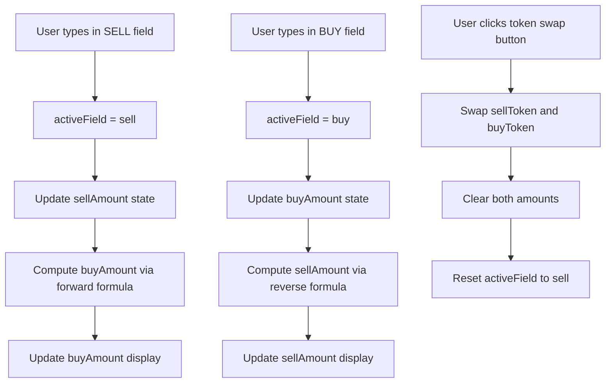
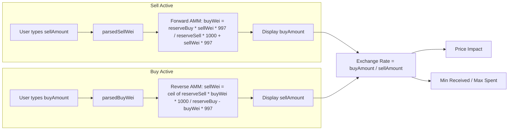

# Bidirectional Swap Input — Implementation Plan

## Overview

Enable users to type in **either** the SELL (top) or BUY (bottom) field, with the other auto-calculating. This works for both **Direct Swap** (`SwapScreen.tsx`) and **Aggregator Swap** (`AggregatorSwap.tsx`).

---

## 1. Current Architecture Summary

### Direct Swap (`SwapScreen.tsx`)
- User types into `sellAmount` state (string) → only the SELL input is editable
- `parsedSell = parseFloat(sellAmount)` drives all calculations
- Pool reserves from `usePoolReserves(OMNOM_WWDOGE_POOL)` → `poolRes0`, `poolRes1`, `poolT0`, `poolT1`
- Forward rate via V2 constant-product formula at [line 200](src/components/SwapScreen.tsx:200):
  ```
  buyWei = (reserveBuy * parsedSellWei * 997n) / (reserveSell * 1000n + parsedSellWei * 997n)
  ```
- Fallback chain: pool-based → V3 Quoter → V2 Router `getAmountsOut`
- BUY field is **read-only** (`readOnly` attribute at [line 649](src/components/SwapScreen.tsx:649))
- `exchangeRate` is a per-unit rate: `buyAmount / sellAmount`
- Swap always executes as `swapExactTokensForTokens` (exact input)

### Aggregator Swap (`AggregatorSwap.tsx`)
- User types into `sellAmount` state → only the SELL input is editable
- [`useRoute`](src/hooks/useAggregator/useRoute.ts:31) hook takes `tokenInAddress`, `tokenOutAddress`, `amountIn` (string), `feeBps`
- Internally calls [`findAllViableRoutes`](src/services/pathFinder/index.ts:215) which:
  1. Builds a liquidity graph from all pool reserves
  2. BFS finds all paths up to 4 hops
  3. Computes output via [`calculateOutput`](src/services/pathFinder/index.ts:75) for each hop
  4. Deducts protocol fee: `feeAmount = (amountIn * feeBps) / 10000`, `swapAmount = amountIn - feeAmount`
- BUY field is **read-only** (`readOnly` at [line 454](src/components/aggregator/AggregatorSwap.tsx:454))
- Route comparison, price impact, and fee display all derive from the route result

### Shared Infrastructure
- [`calculateOutput`](src/services/pathFinder/index.ts:75) — forward AMM math with 0.3% fee
- [`usePoolReserves`](src/hooks/useLiquidity.ts:44) — reads reserves for a single pair
- [`fetchAllPools`](src/services/pathFinder/poolFetcher.ts:96) — reads all pools across all DEXes
- Both screens are rendered by [`UnifiedSwapScreen`](src/components/UnifiedSwapScreen.tsx:26) with a mode toggle

---

## 2. UniswapV2 Reverse Calculation Math

### Forward Formula (existing)
Given `amountIn`, calculate `amountOut`:

```
amountInWithFee = amountIn * 997
amountOut = (reserveOut * amountInWithFee) / (reserveIn * 1000 + amountInWithFee)
```

### Reverse Formula (NEW — `getAmountIn`)
Given desired `amountOut`, calculate required `amountIn`:

```
amountIn = (reserveIn * amountOut * 1000) / ((reserveOut - amountOut) * 997) + 1
```

**Derivation** from `x * y = k` with 0.3% fee:

```
Given: amountOut = (reserveOut * amountIn * 997) / (reserveIn * 1000 + amountIn * 997)

Rearranging:
amountOut * (reserveIn * 1000 + amountIn * 997) = reserveOut * amountIn * 997
amountOut * reserveIn * 1000 + amountOut * amountIn * 997 = reserveOut * amountIn * 997
amountOut * reserveIn * 1000 = amountIn * 997 * (reserveOut - amountOut)
amountIn = (amountOut * reserveIn * 1000) / (997 * (reserveOut - amountOut))
```

The `+ 1` is for rounding up (ceil division in BigInt), ensuring the input is always sufficient.

### Multi-Hop Reverse
For a path `A → B → C` with reserves at each hop:

```
// Step 1: Reverse the last hop (B → C)
amountIn_B = getAmountIn(amountOut_C, reserveIn_BC, reserveOut_BC)

// Step 2: Reverse the first hop (A → B) using amountIn_B as desired output
amountIn_A = getAmountIn(amountIn_B, reserveIn_AB, reserveOut_AB)
```

### Aggregator Fee Adjustment
The aggregator deducts a protocol fee **before** routing:
```
feeAmount = (amountIn * feeBps) / 10000
swapAmount = amountIn - feeAmount
```

To reverse this, given a desired `swapAmount`:
```
amountIn = ceil(swapAmount * 10000 / (10000 - feeBps))
```

---

## 3. State Management Changes

### 3.1 Shared State Type

Create a new shared type that both screens can use:

```typescript
// src/lib/swapState.ts (NEW FILE)

export type ActiveField = 'sell' | 'buy';

export interface BidirectionalSwapState {
  sellAmount: string;      // raw user input string
  buyAmount: string;       // raw user input string
  activeField: ActiveField; // which field the user is currently editing
}
```

### 3.2 Direct Swap State Changes (`SwapScreen.tsx`)

**Current state:**
```
sellAmount: string         // user-typed value
exchangeRate: number       // computed per-unit rate
```

**New state:**
```
sellAmount: string         // user-typed SELL value
buyAmount: string          // user-typed BUY value (NEW)
activeField: 'sell' | 'buy'  // which field is active (NEW)
// exchangeRate removed — replaced by computed buyAmount/sellAmount
```

**State flow:**



### 3.3 Aggregator Swap State Changes (`AggregatorSwap.tsx`)

**Current state:**
```
sellAmount: string         // user-typed value
buyAmount: string          // computed from route (read-only)
```

**New state:**
```
sellAmount: string         // user-typed or computed SELL value
buyAmount: string          // user-typed or computed BUY value
activeField: 'sell' | 'buy'  // which field is active (NEW)
```

---

## 4. New Functions to Implement

### 4.1 `calculateInput` — Reverse AMM Math

Add to [`src/services/pathFinder/index.ts`](src/services/pathFinder/index.ts):

```typescript
/**
 * Calculate required input amount using reverse constant-product AMM formula.
 * Given a desired output, returns the input needed (with 0.3% fee accounted for).
 *
 * amountIn = ceil(reserveIn * amountOut * 1000 / ((reserveOut - amountOut) * 997))
 *
 * Returns 0n if impossible (insufficient liquidity, amountOut >= reserveOut).
 */
export function calculateInput(amountOut: bigint, reserveIn: bigint, reserveOut: bigint): bigint {
  if (amountOut <= 0n || reserveIn <= 0n || reserveOut <= 0n) return 0n;
  if (amountOut >= reserveOut) return 0n; // Cannot take more than available

  const numerator = reserveIn * amountOut * 1000n;
  const denominator = (reserveOut - amountOut) * 997n;

  // Ceiling division: (n + d - 1) / d
  return (numerator + denominator - 1n) / denominator;
}
```

### 4.2 `calculatePathInput` — Multi-Hop Reverse

Add to [`src/services/pathFinder/index.ts`](src/services/pathFinder/index.ts):

```typescript
/**
 * Reverse-calculate the required input for a multi-hop path.
 * Works backwards from the last hop to the first.
 */
export function calculatePathInput(
  path: string[],
  amountOut: bigint,
  edges: PoolEdge[],
): { input: bigint; steps: RouteStep[] } {
  let currentAmount = amountOut;
  const steps: RouteStep[] = [];

  // Walk the path in reverse
  for (let i = path.length - 1; i > 0; i--) {
    const tokenOut = path[i];
    const tokenIn = path[i - 1];

    // Find the best edge for this hop (lowest input required)
    const candidates = edges.filter(
      (e) => e.tokenIn.toLowerCase() === tokenIn.toLowerCase()
        && e.tokenOut.toLowerCase() === tokenOut.toLowerCase(),
    );

    if (candidates.length === 0) return { input: 0n, steps: [] };

    let bestEdge = candidates[0];
    let bestInput = calculateInput(currentAmount, bestEdge.reserveIn, bestEdge.reserveOut);

    for (let j = 1; j < candidates.length; j++) {
      const inp = calculateInput(currentAmount, candidates[j].reserveIn, candidates[j].reserveOut);
      if (inp > 0n && (bestInput === 0n || inp < bestInput)) {
        bestInput = inp;
        bestEdge = candidates[j];
      }
    }

    if (bestInput === 0n) return { input: 0n, steps: [] };

    steps.unshift({
      dexRouter: bestEdge.router,
      dexName: bestEdge.dexName,
      path: [tokenIn, tokenOut],
      amountIn: bestInput,
      expectedAmountOut: currentAmount,
    });

    currentAmount = bestInput;
  }

  return { input: currentAmount, steps };
}
```

### 4.3 `findRoutesForOutput` — Aggregator Reverse Route Finding

Add to [`src/services/pathFinder/index.ts`](src/services/pathFinder/index.ts):

```typescript
/**
 * Find all viable routes given a desired output amount.
 * Reverses the normal flow: given amountOut, finds the required amountIn
 * for each possible path.
 *
 * Returns routes sorted by input ascending (least input required first).
 */
export function findAllRoutesForOutput(
  tokenIn: string,
  tokenOut: string,
  amountOut: bigint,
  pools: PoolReserves[],
  feeBps: number = 25,
  maxRoutes: number = 10,
): RouteResult[] {
  const edges = buildGraph(pools);
  const paths = findAllRoutes(tokenIn, tokenOut, 0n, edges); // amountIn not needed for path enumeration

  if (paths.length === 0) return [];

  const results: RouteResult[] = [];

  for (const path of paths) {
    const { input: swapAmount, steps } = calculatePathInput(path, amountOut, edges);

    if (swapAmount > 0n) {
      // Reverse the fee: amountIn = ceil(swapAmount * 10000 / (10000 - feeBps))
      const feeDenom = 10000n - BigInt(feeBps);
      const totalAmountIn = (swapAmount * 10000n + feeDenom - 1n) / feeDenom;
      const feeAmount = totalAmountIn - swapAmount;

      const priceImpact = estimatePriceImpact(steps, edges);

      results.push({
        id: generateRouteId(steps),
        steps,
        totalAmountIn,
        totalExpectedOut: amountOut,
        priceImpact,
        feeAmount,
        feeBps,
      });
    }
  }

  // Sort by input ascending (least cost first)
  results.sort((a, b) =>
    a.totalAmountIn < b.totalAmountIn ? -1 : a.totalAmountIn > b.totalAmountIn ? 1 : 0
  );

  return results.slice(0, maxRoutes);
}
```

### 4.4 `useReverseRoute` Hook — Aggregator Reverse Calculation

Create new hook at `src/hooks/useAggregator/useReverseRoute.ts`:

```typescript
/**
 * useReverseRoute — hook for reverse path finding (given desired output, find required input).
 *
 * Mirrors the useRoute hook API but operates in reverse.
 * Uses the same debouncing and stale-request handling pattern.
 */
import { useState, useEffect, useCallback, useRef } from 'react';
import { formatUnits } from 'viem';
import { usePublicClient } from 'wagmi';
import { TOKENS, getTokenDecimals } from '../../lib/constants';
import { formatCompactAmount } from '../../lib/format';
import { fetchAllPools } from '../../services/pathFinder/poolFetcher';
import { findAllRoutesForOutput } from '../../services/pathFinder';
import type { RouteResult, PoolReserves, TokenInfo } from '../../services/pathFinder/types';

const DEBOUNCE_MS = 500;

export function useReverseRoute(
  tokenInAddress: string | undefined,
  tokenOutAddress: string | undefined,
  amountOut: string | undefined,
  feeBps: number = 25,
) {
  const [route, setRoute] = useState<RouteResult | null>(null);
  const [allRoutes, setAllRoutes] = useState<RouteResult[]>([]);
  const [isLoading, setIsLoading] = useState(false);
  const [error, setError] = useState<string | null>(null);
  const debounceRef = useRef<ReturnType<typeof setTimeout> | null>(null);
  const seqRef = useRef(0);
  const wagmiPublicClient = usePublicClient();

  const getTokenInfo = (address: string): TokenInfo | undefined => {
    const t = TOKENS.find((t) => t.address.toLowerCase() === address.toLowerCase());
    if (!t) return undefined;
    return { address: t.address, symbol: t.symbol, decimals: t.decimals ?? 18, logoURI: t.icon };
  };

  const compute = useCallback(async () => {
    if (!tokenInAddress || !tokenOutAddress || !amountOut || parseFloat(amountOut) <= 0) {
      setRoute(null);
      setAllRoutes([]);
      setIsLoading(false);
      return;
    }

    const inToken = getTokenInfo(tokenInAddress);
    const outToken = getTokenInfo(tokenOutAddress);
    if (!inToken || !outToken) { setRoute(null); setAllRoutes([]); setIsLoading(false); return; }

    setIsLoading(true);
    setError(null);
    const seq = ++seqRef.current;

    try {
      const allPools = wagmiPublicClient
        ? await fetchAllPools(TOKENS.map(t => ({
            address: t.address, symbol: t.symbol,
            decimals: t.decimals ?? 18, logoURI: t.icon,
          })), wagmiPublicClient)
        : await fetchAllPools(TOKENS.map(t => ({
            address: t.address, symbol: t.symbol,
            decimals: t.decimals ?? 18, logoURI: t.icon,
          })));

      if (seq !== seqRef.current) return;

      const amountOutWei = parseUnits(amountOut, outToken.decimals);
      const routes = findAllRoutesForOutput(tokenInAddress, tokenOutAddress, amountOutWei, allPools, feeBps);

      if (seq !== seqRef.current) return;
      setAllRoutes(routes);
      setRoute(routes.length > 0 ? routes[0] : null);
    } catch (err) {
      if (seq !== seqRef.current) return;
      setError(err instanceof Error ? err.message : 'Reverse route computation failed');
      setRoute(null);
      setAllRoutes([]);
    } finally {
      if (seq === seqRef.current) setIsLoading(false);
    }
  }, [tokenInAddress, tokenOutAddress, amountOut, feeBps, wagmiPublicClient]);

  useEffect(() => {
    if (debounceRef.current) clearTimeout(debounceRef.current);
    debounceRef.current = setTimeout(compute, DEBOUNCE_MS);
    return () => { if (debounceRef.current) clearTimeout(debounceRef.current); };
  }, [compute]);

  const inDecimals = tokenInAddress ? getTokenDecimals(tokenInAddress) : 18;
  const formattedInput = route && route.totalAmountIn > 0n
    ? (() => {
        const raw = formatUnits(route.totalAmountIn, inDecimals);
        const num = parseFloat(raw);
        return formatCompactAmount(num);
      })()
    : null;

  return {
    route,
    allRoutes,
    setRoute,
    isLoading,
    error,
    formattedInput,
    inDecimals,
  };
}
```

---

## 5. Specific File Changes

### 5.1 `src/services/pathFinder/index.ts`

| Change | Description |
|--------|-------------|
| Add `calculateInput()` | Reverse AMM math — section 4.1 above |
| Add `calculatePathInput()` | Multi-hop reverse — section 4.2 above |
| Add `findAllRoutesForOutput()` | Reverse route finding — section 4.3 above |

### 5.2 `src/hooks/useAggregator/useReverseRoute.ts` (NEW FILE)

New hook mirroring `useRoute` but for reverse calculation — section 4.4 above.

### 5.3 `src/components/SwapScreen.tsx`

#### State changes:
```typescript
// BEFORE:
const [sellAmount, setSellAmount] = useState<string>('');
const [exchangeRate, setExchangeRate] = useState(0);

// AFTER:
const [sellAmount, setSellAmount] = useState<string>('');
const [buyAmount, setBuyAmount] = useState<string>('');
const [activeField, setActiveField] = useState<'sell' | 'buy'>('sell');
// exchangeRate state removed — computed as derived value
```

#### New computed values:

```typescript
// Derived: which parsed amount drives the calculation
const parsedSell = parseFloat(sellAmount) || 0;
const parsedBuy = parseFloat(buyAmount) || 0;

// Forward calculation: SELL → BUY (existing logic, refactored)
const computedBuyAmount = useMemo(() => {
  if (activeField !== 'sell' || parsedSell <= 0) return '';
  // Use existing poolBasedRate logic but return the buy amount directly
  if (poolT0 && poolT1 && parsedSellWei > 0n) {
    // ... same reserve matching logic ...
    const buyWei = (reserveBuy * parsedSellWei * 997n) / (reserveSell * 1000n + parsedSellWei * 997n);
    return formatUnits(buyWei, buyDecimals);
  }
  // Fallback to V3/V2 quotes...
  return '';
}, [activeField, parsedSell, parsedSellWei, poolRes0, poolRes1, poolT0, poolT1, ...]);

// Reverse calculation: BUY → SELL (NEW)
const computedSellAmount = useMemo(() => {
  if (activeField !== 'buy' || parsedBuy <= 0) return '';
  const parsedBuyWei = parseUnits(parsedBuy.toString(), buyDecimals);
  if (poolT0 && poolT1 && parsedBuyWei > 0n) {
    const buyAddr = (isNativeToken(buyToken) ? CONTRACTS.WWDOGE : buyToken.address).toLowerCase();
    const sellAddr = (isNativeToken(sellToken) ? CONTRACTS.WWDOGE : sellToken.address).toLowerCase();
    const sellIsT0 = sellAddr === poolT0.toLowerCase();
    const buyIsT1 = buyAddr === poolT1.toLowerCase();
    const buyIsT0 = buyAddr === poolT0.toLowerCase();
    const sellIsT1 = sellAddr === poolT1.toLowerCase();
    if (!((sellIsT0 && buyIsT1) || (sellIsT1 && buyIsT0))) return '';
    const reserveSell = sellIsT0 ? poolRes0 : poolRes1;
    const reserveBuy = sellIsT0 ? poolRes1 : poolRes0;
    if (reserveSell <= 0n || reserveBuy <= 0n || parsedBuyWei >= reserveBuy) return '';
    // Reverse formula: amountIn = ceil(reserveIn * amountOut * 1000 / ((reserveOut - amountOut) * 997))
    const numerator = reserveSell * parsedBuyWei * 1000n;
    const denominator = (reserveBuy - parsedBuyWei) * 997n;
    const sellWei = (numerator + denominator - 1n) / denominator;
    return formatUnits(sellWei, sellDecimals);
  }
  return '';
}, [activeField, parsedBuy, buyToken, sellToken, poolRes0, poolRes1, poolT0, poolT1, ...]);

// Exchange rate (derived, not stored as state)
const exchangeRate = useMemo(() => {
  if (activeField === 'sell' && parsedSell > 0 && parsedBuy > 0) {
    return parsedBuy / parsedSell;
  }
  if (activeField === 'buy' && parsedSell > 0 && parsedBuy > 0) {
    return parsedBuy / parsedSell;
  }
  return 0;
}, [activeField, parsedSell, parsedBuy]);
```

#### Input handlers:

```typescript
const handleSellAmountChange = (e: React.ChangeEvent<HTMLInputElement>) => {
  const val = e.target.value;
  if (val === '' || /^\d*\.?\d*$/.test(val)) {
    if (val.includes('.') && val.split('.')[1]?.length > 18) return;
    setSellAmount(val);
    setActiveField('sell');
  }
};

// NEW handler for buy field
const handleBuyAmountChange = (e: React.ChangeEvent<HTMLInputElement>) => {
  const val = e.target.value;
  if (val === '' || /^\d*\.?\d*$/.test(val)) {
    if (val.includes('.') && val.split('.')[1]?.length > 18) return;
    setBuyAmount(val);
    setActiveField('buy');
  }
};
```

#### Effect to sync computed values:

```typescript
// When activeField is 'sell', update buyAmount from computation
useEffect(() => {
  if (activeField === 'sell' && computedBuyAmount !== '') {
    setBuyAmount(computedBuyAmount);
  }
}, [activeField, computedBuyAmount]);

// When activeField is 'buy', update sellAmount from computation
useEffect(() => {
  if (activeField === 'buy' && computedSellAmount !== '') {
    setSellAmount(computedSellAmount);
  }
}, [activeField, computedSellAmount]);
```

#### UI changes:

**BUY input field** — remove `readOnly`, add `onChange`:
```tsx
// BEFORE (line ~649):
<input
  type="text"
  value={parsedSell > 0 && exchangeRate > 0 ? buyAmount : ''}
  readOnly
  className="... opacity-80"
  placeholder="0.00"
/>

// AFTER:
<input
  type="text"
  value={buyAmount}
  onChange={handleBuyAmountChange}
  className="... opacity-80"
  placeholder="0.00"
/>
```

**Price impact** — must work in both directions:
```typescript
const priceImpact = (() => {
  // Use the effective sell amount (either typed or computed)
  const effectiveSell = activeField === 'sell' ? parsedSell : (parseFloat(computedSellAmount) || 0);
  if (effectiveSell <= 0 || !poolT0) return 0;
  const sellAddr = (isNativeToken(sellToken) ? CONTRACTS.WWDOGE : sellToken.address).toLowerCase();
  const reserveSell = sellAddr === poolT0.toLowerCase()
    ? Number(formatUnits(poolRes0, sellDecimals))
    : Number(formatUnits(poolRes1, sellDecimals));
  return calcPriceImpact(effectiveSell, reserveSell);
})();
```

**Swap execution** — always use `sellAmount` as the input amount regardless of `activeField`:
```typescript
// The parsedSellWei should use the effective sell amount
const effectiveSellAmount = activeField === 'sell' ? sellAmount : computedSellAmount;
const parsedSellWei = parseFloat(effectiveSellAmount) > 0
  ? parseUnits(effectiveSellAmount, sellDecimals)
  : 0n;
```

**Token swap button** — clear both fields:
```typescript
const handleSwapTokens = () => {
  const temp = sellToken;
  setSellToken(buyToken);
  setBuyToken(temp);
  setSellAmount('');
  setBuyAmount('');
  setActiveField('sell');
  setSwapFlip(prev => !prev);
};
```

**Input validation** — check balance against the sell amount:
```typescript
const inputError = (() => {
  if (!isConnected) return null;
  const effectiveSell = activeField === 'sell' ? parsedSell : (parseFloat(computedSellAmount) || 0);
  if (!effectiveSell || effectiveSell <= 0) return null;
  if (isNaN(effectiveSell) || !isFinite(effectiveSell)) return 'Invalid amount';
  if (effectiveSell > 1e18) return 'Amount too large';
  if (effectiveSell > displaySellBalance) return 'Insufficient balance';
  return null;
})();
```

**Min received** — when active field is BUY, show "Max Spent" instead:
```typescript
// When user typed in BUY field, the "min received" concept flips:
// We show the max they'll spend (with slippage applied to the input side)
const displayMinReceived = activeField === 'sell'
  ? `${fmtAmt(parsedSell * exchangeRate * (1 - parsedSlippage / 100))} ${buyToken.symbol}`
  : `${fmtAmt((parseFloat(computedSellAmount) || 0) * (1 + parsedSlippage / 100))} ${sellToken.symbol}`;
```

### 5.4 `src/components/aggregator/AggregatorSwap.tsx`

#### State changes:
```typescript
// BEFORE:
const [sellAmount, setSellAmount] = useState('');

// AFTER:
const [sellAmount, setSellAmount] = useState('');
const [buyAmountInput, setBuyAmountInput] = useState('');
const [activeField, setActiveField] = useState<'sell' | 'buy'>('sell');
```

#### Hook usage:
```typescript
// Existing forward route hook (used when activeField === 'sell')
const {
  route: forwardRoute,
  allRoutes: forwardAllRoutes,
  setRoute: setForwardRoute,
  dexQuotes,
  isLoading: forwardLoading,
  formattedOutput,
  outDecimals,
} = useRoute(sellToken.address, buyToken.address, sellAmount, feeBps);

// NEW reverse route hook (used when activeField === 'buy')
const {
  route: reverseRoute,
  allRoutes: reverseAllRoutes,
  setRoute: setReverseRoute,
  isLoading: reverseLoading,
  formattedInput,
  inDecimals,
} = useReverseRoute(sellToken.address, buyToken.address, buyAmountInput, feeBps);

// Effective values based on active field
const route = activeField === 'sell' ? forwardRoute : reverseRoute;
const allRoutes = activeField === 'sell' ? forwardAllRoutes : reverseAllRoutes;
const setRoute = activeField === 'sell' ? setForwardRoute : setReverseRoute;
const isLoading = activeField === 'sell' ? forwardLoading : reverseLoading;

// Computed amounts
const buyAmount = activeField === 'sell' ? (formattedOutput ?? '0') : buyAmountInput;
const effectiveSellAmount = activeField === 'sell' ? sellAmount : (formattedInput ?? '');
```

#### Input handlers:
```typescript
const handleSellAmountChange = (e: React.ChangeEvent<HTMLInputElement>) => {
  const val = e.target.value;
  if (val === '' || /^\d*\.?\d*$/.test(val)) {
    if (val.includes('.') && val.split('.')[1]?.length > sellDecimals) return;
    setSellAmount(val);
    setActiveField('sell');
    resetSwap();
  }
};

// NEW
const handleBuyAmountChange = (e: React.ChangeEvent<HTMLInputElement>) => {
  const val = e.target.value;
  if (val === '' || /^\d*\.?\d*$/.test(val)) {
    const buyDecimals = getTokenDecimals(buyToken.address);
    if (val.includes('.') && val.split('.')[1]?.length > buyDecimals) return;
    setBuyAmountInput(val);
    setActiveField('buy');
    resetSwap();
  }
};
```

#### UI changes:

**BUY input** — remove `readOnly`, add `onChange`:
```tsx
// BEFORE (line ~451):
<input
  type="text"
  value={buyAmount}
  readOnly
  placeholder="0.00"
  className="... opacity-80"
/>

// AFTER:
<input
  type="text"
  value={buyAmount}
  onChange={handleBuyAmountChange}
  placeholder="0.00"
  className="... opacity-80"
/>
```

**Token swap** — clear both fields:
```typescript
const handleSwapTokens = useCallback(() => {
  const temp = sellToken;
  setSellToken(buyToken);
  setBuyToken(temp);
  setSellAmount('');
  setBuyAmountInput('');
  setActiveField('sell');
  resetSwap();
  setSwapFlip(prev => !prev);
}, [sellToken, buyToken, resetSwap]);
```

**Swap execution** — use `effectiveSellAmount`:
```typescript
const handleConfirmSwap = async () => {
  if (!route || route.steps.length === 0) return;
  setShowConfirmModal(false);
  setIsSwapping(true);
  try {
    await executeSwap(route, slippageBps, deadlineMin);
  } finally {
    setIsSwapping(false);
  }
};
```

**Input validation** — check against effective sell:
```typescript
const inputError = (() => {
  if (!isConnected) return null;
  const effectiveSell = activeField === 'sell'
    ? parseFloat(sellAmount)
    : parseFloat(effectiveSellAmount);
  if (!effectiveSell || effectiveSell <= 0) return null;
  if (isNaN(effectiveSell) || !isFinite(effectiveSell)) return 'Invalid amount';
  if (effectiveSell > 1e18) return 'Amount too large';
  if (effectiveSell > parseFloat(sellBalance)) return 'Insufficient balance';
  return null;
})();
```

---

## 6. Edge Case Handling

### 6.1 Insufficient Liquidity
- **Forward:** If `amountIn * 997 >= reserveIn * 1000`, output approaches 0. Already handled.
- **Reverse:** If `amountOut >= reserveOut`, return `0n` from `calculateInput`. Display "Insufficient liquidity" error.

### 6.2 Zero Reserves
- Both `calculateOutput` and `calculateInput` return `0n` when any reserve is `0n`. No division by zero possible.

### 6.3 Very Large Amounts
- BigInt arithmetic handles values up to `uint256` without overflow.
- UI validates `amount > 1e18` as "Amount too large".

### 6.4 Rounding
- Forward: uses floor division (standard for `amountOut`)
- Reverse: uses ceiling division (`(n + d - 1) / d`) to ensure the input is always sufficient
- Display: format with appropriate decimals, truncate trailing zeros

### 6.5 Reserve Loading State
- When reserves haven't loaded yet (`poolT0 === undefined`), show placeholder "Loading..." or empty field
- Don't compute rates until reserves are available

### 6.6 Rapid Field Switching
- When user clicks from SELL to BUY field rapidly, `activeField` updates immediately
- The debounce in `useRoute` / `useReverseRoute` prevents excessive computation
- Stale request handling (`seqRef`) ensures only the latest computation is used

### 6.7 Same Token Selected
- If `sellToken === buyToken`, both fields should show the same value (rate = 1)
- Already handled in existing code; no change needed

### 6.8 Amount Exceeds Balance
- When `activeField === 'buy'`, the computed `sellAmount` might exceed user balance
- Show "Insufficient balance" error in this case
- The swap button should be disabled

---

## 7. UI/UX Considerations

### 7.1 Visual Indicators
- The **active field** should have a brighter border/highlight (already has `border-primary` for SELL)
- The **inactive/computed field** should have reduced opacity (already `opacity-80`)
- Consider adding a subtle loading spinner inside the computed field while calculating

### 7.2 Cursor Position
- When the computed value updates, the cursor in the active field should NOT jump
- This is naturally handled because we only update the *other* field's state
- The active field's `value` is controlled by user input, not computation

### 7.3 Field Switching
- When user clicks the BUY field to type, `activeField` changes to `'buy'`
- The SELL field immediately shows the computed value (may flash empty briefly during debounce)
- Consider showing a faint "Calculating..." placeholder during the debounce window

### 7.4 Number Formatting
- The computed field should show a reasonable number of decimal places (match token decimals)
- Avoid showing scientific notation or excessive precision
- Use existing `formatCompactAmount` for display, but keep raw values in state for calculations

### 7.5 Label Changes
- When `activeField === 'buy'`: change SELL label from "You Sell" to "You Sell (Estimated)"
- When `activeField === 'sell'`: keep BUY label as "You Buy (Estimated)"
- This makes it clear which field is the "exact" amount

### 7.6 Swap Button Text
- No change needed — still shows "CHOMP THE SWAP" when ready
- The button always executes `swapExactTokensForTokens` with the sell amount as input

---

## 8. Slippage Application

### When `activeField === 'sell'` (current behavior):
- `amountOutMin = buyWeiOut * (10000 - slippageBps) / 10000`
- Display: "Min. Received: X tokens"

### When `activeField === 'buy'` (NEW):
- The swap still executes as `swapExactTokensForTokens` with the computed sell amount
- `amountOutMin = desiredBuyAmount * (10000 - slippageBps) / 10000`
- Display: "Min. Received: X tokens" (same as before, since the user specified the exact desired output)
- The actual input might be slightly different due to rounding, but the output guarantee holds

### Price Impact:
- Always calculated based on the sell amount relative to reserves
- When `activeField === 'buy'`, use the computed sell amount for impact calculation

---

## 9. Data Flow Diagrams

### Direct Swap — Bidirectional Flow



### Aggregator Swap — Bidirectional Flow

```mermaid
flowchart TD
    subgraph Forward Mode - activeField = sell
        FS[User types sellAmount] --> FH[useRoute hook]
        FH --> FP[fetchAllPools]
        FP --> FB[BFS path finding]
        FB --> FC[calculateOutput per hop]
        FC --> FR[RouteResult sorted by output desc]
    end

    subgraph Reverse Mode - activeField = buy
        BS[User types buyAmount] --> BH[useReverseRoute hook]
        BH --> BP[fetchAllPools]
        BP --> BB[BFS path finding - same paths]
        BB --> BK[calculatePathInput - reverse per hop]
        BK --> BR[RouteResult sorted by input asc]
    end

    FR --> SEL[Selected Route]
    BR --> SEL
    SEL --> SWAP[executeSwap with route]
```

---

## 10. Testing Strategy

### 10.1 Unit Tests — AMM Math

Test file: `src/services/pathFinder/__tests__/amm.test.ts`

| Test Case | Description |
|-----------|-------------|
| Forward → Reverse roundtrip | `calculateInput(calculateOutput(x, rIn, rOut), rIn, rOut) ≈ x` |
| Reverse with zero reserves | `calculateInput(out, 0n, 0n) === 0n` |
| Reverse with amountOut >= reserveOut | `calculateInput(reserveOut, rIn, rOut) === 0n` |
| Reverse with small amounts | Verify precision for sub-wei values |
| Reverse with large amounts | Verify no overflow for uint256-scale values |
| Ceiling division correctness | Ensure `calculateInput` always returns sufficient input |

### 10.2 Unit Tests — Path Finder

Test file: `src/services/pathFinder/__tests__/pathfinder.test.ts`

| Test Case | Description |
|-----------|-------------|
| Single-hop reverse | `calculatePathInput` for A→B path |
| Multi-hop reverse | `calculatePathInput` for A→B→C path |
| No liquidity path | Returns `input: 0n` when no edges exist |
| Best edge selection | Chooses edge requiring least input |
| `findAllRoutesForOutput` basic | Returns routes sorted by input ascending |
| Fee reversal accuracy | `totalAmountIn - feeAmount ≈ swapAmount` |

### 10.3 Component Tests — Direct Swap

Test file: `src/components/__tests__/SwapScreen.test.tsx`

| Test Case | Description |
|-----------|-------------|
| Type in SELL → BUY auto-fills | Verify forward calculation |
| Type in BUY → SELL auto-fills | Verify reverse calculation |
| Switch fields mid-type | Active field tracking works correctly |
| Insufficient liquidity error | Shows error when amountOut > reserves |
| Balance check in reverse mode | Shows error when computed sell > balance |
| Swap execution from BUY mode | Executes with correct sell amount |
| Token swap clears both fields | Both amounts reset on direction flip |

### 10.4 Component Tests — Aggregator Swap

Test file: `src/components/aggregator/__tests__/AggregatorSwap.test.tsx`

| Test Case | Description |
|-----------|-------------|
| Type in SELL → routes appear | Existing behavior preserved |
| Type in BUY → routes appear | Reverse route finding works |
| Route comparison in reverse mode | Shows correct route options |
| Fee display in reverse mode | Shows correct protocol fee |
| Swap execution from BUY mode | Executes with correct route |

### 10.5 Integration Tests

| Test Case | Description |
|-----------|-------------|
| Switch from Direct to Aggregated mode | State resets correctly |
| Rapid field switching | No stale values displayed |
| Network change mid-input | Values clear appropriately |
| Wallet connect/disconnect | Balance checks update |

---

## 11. Implementation Order

1. **Add `calculateInput` to `pathFinder/index.ts`** — pure function, no side effects
2. **Add `calculatePathInput` to `pathFinder/index.ts`** — uses `calculateInput`
3. **Add `findAllRoutesForOutput` to `pathFinder/index.ts`** — uses `calculatePathInput`
4. **Write unit tests for AMM math** — verify formulas before integrating
5. **Create `useReverseRoute` hook** — mirrors `useRoute` pattern
6. **Update `SwapScreen.tsx`** — add `activeField`, `buyAmount` state, reverse calculation
7. **Update `AggregatorSwap.tsx`** — add `activeField`, `buyAmountInput` state, `useReverseRoute`
8. **Write component tests** — verify UI behavior
9. **Visual polish** — loading states, label changes, error messages

---

## 12. Files to Create/Modify Summary

| File | Action | Description |
|------|--------|-------------|
| `src/services/pathFinder/index.ts` | MODIFY | Add `calculateInput`, `calculatePathInput`, `findAllRoutesForOutput` |
| `src/hooks/useAggregator/useReverseRoute.ts` | CREATE | Reverse route hook mirroring `useRoute` |
| `src/components/SwapScreen.tsx` | MODIFY | Add bidirectional state, reverse calc, editable BUY field |
| `src/components/aggregator/AggregatorSwap.tsx` | MODIFY | Add bidirectional state, reverse route hook, editable BUY field |
| `src/services/pathFinder/__tests__/amm.test.ts` | CREATE | AMM math unit tests |
| `src/services/pathFinder/__tests__/pathfinder.test.ts` | CREATE | Path finder unit tests |
| `src/components/__tests__/SwapScreen.test.tsx` | CREATE | Direct Swap component tests |
| `src/components/aggregator/__tests__/AggregatorSwap.test.tsx` | CREATE | Aggregator component tests |
