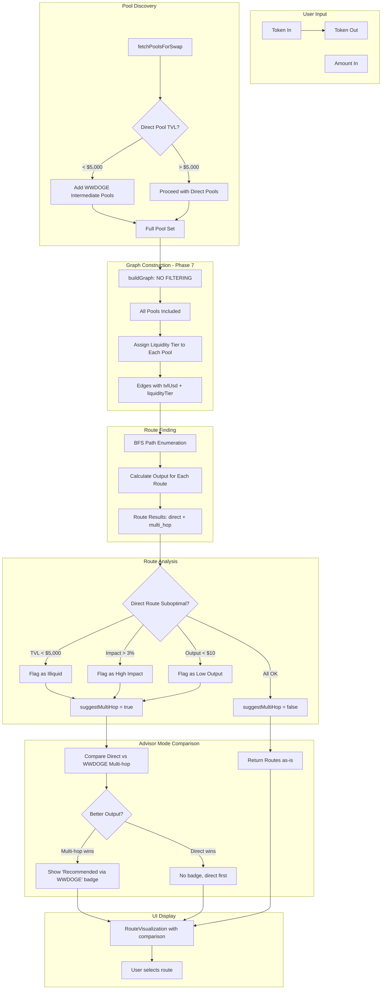

# WWDOGE Multi-Hop Routing Strategy — Architectural Plan

## Context

**Current Problem**: The pathfinding system has a $1,000 TVL filter in [`buildGraph()`](src/services/pathFinder/index.ts:290) that **excludes** low-liquidity pools from the routing graph. This is too restrictive because:
- Small pools may still execute swaps successfully at small volumes
- Users should be informed of options, not have them silently removed
- The aggregator should suggest alternatives, not eliminate choices

**Goal**: Change from **exclusion** to **advisory** mode — keep all pools in the graph, but flag them by liquidity tier and suggest multi-hop WWDOGE routing when direct routes are suboptimal.

---

## 1. Modified Data Structures (types.ts)

### New Liquidity Tier System

```typescript
// ─── Liquidity Tiers ─────────────────────────────────────────────────────────

export type LiquidityTier = 'optimal' | 'acceptable' | 'low' | 'very_low';

export interface LiquidityThresholds {
  optimal: number;    // > $50,000 TVL
  acceptable: number; // $10,000 - $50,000
  low: number;        // $5,000 - $10,000  
  veryLow: number;    // < $5,000 (previously filtered out)
}

/**
 * Thresholds for triggering multi-hop WWDOGE routing suggestions.
 * Used to determine when the system should prefer multi-hop over direct.
 */
export const ROUTING_THRESHOLDS = {
  /** TVL below which direct routes are considered illiquid ($5,000). */
  TVL_ILLIQUID_THRESHOLD: 5_000,
  /** Price impact threshold (>3%) triggers multi-hop routing suggestion. */
  PRICE_IMPACT_THRESHOLD: 0.03,
  /** Output value below which route is considered suboptimal (e.g., $10). */
  MIN_OUTPUT_USD: 10,
} as const;
```

### Extended PoolReserves with Liquidity Metadata

```typescript
export interface PoolReserves {
  reserve0: bigint;
  reserve1: bigint;
  token0: string;
  token1: string;
  factory: string;
  dexName: string;
  router: string;
  lastFetched?: number;
  /** Estimated TVL in USD (geometric mean of reserves × WWDOGE price). */
  tvlUsd?: number;
  /** Liquidity tier classification. */
  liquidityTier?: LiquidityTier;
}
```

### Extended RouteResult with Liquidity Analysis

```typescript
export interface RouteResult {
  id: string;
  steps: RouteStep[];
  totalAmountIn: bigint;
  totalExpectedOut: bigint;
  priceImpact: number;
  feeAmount: bigint;
  feeBps: number;
  routeType?: 'direct' | 'multi_hop';
  intermediateToken?: string;
  /** Analysis data for UI display */
  routeAnalysis?: {
    isSuboptimal: boolean;
    suboptimalReason?: string;
    directRouteAvailable: boolean;
    directRouteTvlUsd: number;
    directRouteOutput?: bigint;
    multiHopOutput?: bigint;
    savingsPercent?: number;
  };
}
```

### Advisor Mode Configuration

```typescript
/**
 * Configuration for route advisor mode.
 * When enabled, shows suggestions rather than auto-sorting.
 */
export interface RouteAdvisorConfig {
  /** Enable advisory mode (suggest rather than auto-prefer). */
  enabled: boolean;
  /** Show "Recommended via WWDOGE" badge on multi-hop suggestions. */
  showWwdogeBadge: boolean;
  /** Show comparison view (direct vs multi-hop). */
  showComparisonView: boolean;
  /** Show "Low Liquidity" warnings on thin pools. */
  showLowLiquidityWarnings: boolean;
}

export const DEFAULT_ADVISOR_CONFIG: RouteAdvisorConfig = {
  enabled: true,
  showWwdogeBadge: true,
  showComparisonView: true,
  showLowLiquidityWarnings: true,
};
```

---

## 2. New/Modified Functions in pathFinder Service

### 2.1 Remove MIN_LIQUIDITY Filter in buildGraph()

**File**: [`src/services/pathFinder/index.ts`](src/services/pathFinder/index.ts:290)

**Change**: The `buildGraph()` function currently filters out pools below `MIN_LIQUIDITY_USD`. Replace this with a **flagging** mechanism instead:

```typescript
/**
 * Build a directed liquidity graph from pool reserves.
 * Each pool creates two edges (token0→token1 and token1→token0).
 *
 * ENHANCED Phase 7: No longer filters low-liquidity pools.
 * Instead, pools are kept in the graph but flagged with liquidity tier.
 * This allows small pools to be considered for small-volume swaps
 * while still triggering multi-hop suggestions for large-volume trades.
 */
export function buildGraph(pools: PoolReserves[]): PoolEdge[] {
  const edges: PoolEdge[] = [];

  for (const pool of pools) {
    if (pool.reserve0 <= 0n || pool.reserve1 <= 0n) continue;

    // Phase 7: NO filtering — keep all pools
    // Liquidity assessment happens at route ranking time

    // Forward edge: token0 → token1
    edges.push({
      tokenIn: pool.token0,
      tokenOut: pool.token1,
      reserveIn: pool.reserve0,
      reserveOut: pool.reserve1,
      factory: pool.factory,
      dexName: pool.dexName,
      router: pool.router,
      // Attach liquidity metadata to edge for later analysis
      tvlUsd: pool.tvlUsd,
      liquidityTier: pool.liquidityTier,
    });
    // ... reverse edge
  }
  return edges;
}
```

### 2.2 New: Classify Pool Liquidity

**File**: [`src/services/pathFinder/index.ts`](src/services/pathFinder/index.ts) (new function)

```typescript
/**
 * Classify a pool's liquidity tier based on estimated TVL.
 * Used to determine route quality and trigger multi-hop suggestions.
 */
export function classifyPoolLiquidity(tvlUsd: number): LiquidityTier {
  if (tvlUsd > 50_000) return 'optimal';
  if (tvlUsd >= 10_000) return 'acceptable';
  if (tvUsd >= 5_000) return 'low';
  return 'very_low';
}

/**
 * Estimate TVL for a pool from reserves.
 * Uses geometric mean to avoid overweighting either token.
 * Requires WWDOGE price feed for accurate USD conversion.
 */
export function estimatePoolTVL(reserve0: bigint, reserve1: bigint, wwdogePrice: number = 1.0): number {
  const r0 = Number(reserve0);
  const r1 = Number(reserve1);
  const tvl = 2 * Math.sqrt(r0 * r1) * wwdogePrice;
  return tvl;
}
```

### 2.3 Enhanced: analyzeRouteLiquidity()

**File**: [`src/services/pathFinder/index.ts`](src/services/pathFinder/index.ts:138)

**Change**: Extend to compare direct vs multi-hop outputs and determine if multi-hop **should be suggested** vs **must be used**:

```typescript
export interface RouteLiquidityAnalysis {
  shouldPreferMultiHop: boolean;
  directRouteTVL: number;
  directRoutePriceImpact: number;
  directRouteOutput?: bigint;
  multiHopOutput?: bigint;
  savingsPercent?: number;
  reason: string | null;
  suggestedIntermediate: string | null;
  /** Comparison data for UI */
  comparison?: {
    directLabel: string;
    multiHopLabel: string;
    outputDifference: string;
    recommendation: 'direct' | 'multi_hop' | 'either';
  };
}

/**
 * Analyze route liquidity and determine if multi-hop should be suggested.
 * Returns detailed comparison between direct and multi-hop options.
 */
export function analyzeRouteLiquidity(
  tokenIn: string,
  tokenOut: string,
  pools: PoolReserves[],
): RouteLiquidityAnalysis {
  // ... existing logic ...
  // Additionally calculate:
  // - multiHopOutput via WWDOGE
  // - savingsPercent = (multiHopOutput - directOutput) / directOutput * 100
  // - comparison object for UI
}
```

### 2.4 New: Compare Routes Function

**File**: [`src/services/pathFinder/index.ts`](src/services/pathFinder/index.ts) (new function)

```typescript
/**
 * Compare direct vs multi-hop routes and return analysis.
 * Used for the "advisor mode" comparison view.
 */
export function compareRoutes(
  directRoute: RouteResult | null,
  multiHopRoute: RouteResult | null,
  tokenOutDecimals: number,
): {
  hasBetterAlternative: boolean;
  betterRoute: 'direct' | 'multi_hop' | null;
  outputDifference: bigint;
  savingsPercent: number;
  message: string;
} {
  if (!directRoute || !multiHopRoute) {
    return { hasBetterAlternative: false, betterRoute: null, outputDifference: 0n, savingsPercent: 0, message: '' };
  }

  const diff = multiHopRoute.totalExpectedOut - directRoute.totalExpectedOut;
  const savingsPercent = Number(diff * 10000n / directRoute.totalExpectedOut) / 100;

  return {
    hasBetterAlternative: diff > 0n,
    betterRoute: diff > 0n ? 'multi_hop' : 'direct',
    outputDifference: diff,
    savingsPercent,
    message: diff > 0n
      ? `Multi-hop via WWDOGE yields ${savingsPercent.toFixed(2)}% more`
      : `Direct route is optimal`,
  };
}
```

### 2.5 New: Route Advisor Wrapper

```typescript
/**
 * Wrap route finding with advisory logic.
 * When enabled, this returns a result with comparison data and suggestions
 * rather than auto-sorting routes.
 */
export function findRoutesWithAdvice(
  tokenIn: string,
  tokenOut: string,
  amountIn: bigint,
  pools: PoolReserves[],
  config: RouteAdvisorConfig = DEFAULT_ADVISOR_CONFIG,
): {
  routes: RouteResult[];
  analysis: RouteLiquidityAnalysis | null;
  comparison: ReturnType<typeof compareRoutes> | null;
} {
  // 1. Build graph (no filtering)
  const edges = buildGraph(pools);

  // 2. Find all routes
  const routes = findAllViableRoutes(tokenIn, tokenOut, amountIn, pools);

  // 3. Analyze liquidity
  const analysis = analyzeRouteLiquidity(tokenIn, tokenOut, pools);

  // 4. Compare best direct vs best WWDOGE multi-hop
  const bestDirect = routes.find(r => r.routeType === 'direct');
  const bestMultiHop = routes.find(r =>
    r.routeType === 'multi_hop' &&
    r.intermediateToken?.toLowerCase() === WWDOGE_ADDRESS.toLowerCase()
  );

  const comparison = compareRoutes(bestDirect ?? null, bestMultiHop ?? null, 18);

  return { routes, analysis, comparison };
}
```

---

## 3. UI Component Changes

### 3.1 RouteVisualization.tsx Enhancements

**File**: [`src/components/aggregator/RouteVisualization.tsx`](src/components/aggregator/RouteVisualization.tsx)

#### New Props

```typescript
interface RouteVisualizationProps {
  // ... existing props ...
  /** Advisor mode configuration */
  advisorConfig?: RouteAdvisorConfig;
  /** Liquidity analysis from useRoute */
  routeLiquidityAnalysis?: RouteLiquidityAnalysis | null;
  /** Comparison result between direct and multi-hop */
  routeComparison?: ReturnType<typeof compareRoutes> | null;
}
```

#### New UI Elements

1. **"Recommended via WWDOGE" Badge** (for multi-hop routes that are suggested)
   ```tsx
   {route.routeType === 'multi_hop' && route.intermediateToken?.toLowerCase() === WWDOGE_ADDRESS && (
     <span className="flex items-center gap-1 px-2 py-0.5 bg-primary/10 border border-primary/20 rounded-full text-[10px] text-primary">
       <Zap className="w-3 h-3" />
       Recommended via WWDOGE
     </span>
   )}
   ```

2. **"Low Liquidity" Warning Badge** (for direct routes with low TVL)
   ```tsx
   {route.routeType === 'direct' && routeLiquidityAnalysis?.shouldPreferMultiHop && (
     <span className="flex items-center gap-1 px-2 py-0.5 bg-yellow-500/10 border border-yellow-500/20 rounded-full text-[10px] text-yellow-400">
       <AlertTriangle className="w-3 h-3" />
       Low Liquidity
     </span>
   )}
   ```

3. **Comparison View Section** (advisor mode)
   ```tsx
   {advisorConfig?.showComparisonView && routeComparison?.hasBetterAlternative && (
     <div className="mt-4 p-3 bg-surface-container-highest border border-outline-variant/15 rounded-lg">
       <div className="flex items-center gap-2 mb-2">
         <Info className="w-4 h-4 text-primary" />
         <span className="font-headline text-xs uppercase tracking-widest text-primary">
           Route Comparison
         </span>
       </div>
       <div className="text-[10px] text-on-surface-variant mb-2">
         {routeComparison.message}
       </div>
       {/* Side-by-side comparison of direct vs multi-hop */}
       <div className="grid grid-cols-2 gap-2">
         {/* Direct option card */}
         {/* Multi-hop option card */}
       </div>
     </div>
   )}
   ```

### 3.2 New: RouteComparisonCard Component

**File**: [`src/components/aggregator/RouteComparisonCard.tsx`](src/components/aggregator/RouteComparisonCard.tsx) (new file)

A reusable component for showing direct vs multi-hop comparison:

```tsx
interface RouteComparisonCardProps {
  directRoute: RouteResult | null;
  multiHopRoute: RouteResult | null;
  comparison: ReturnType<typeof compareRoutes>;
  onSelectRoute: (route: RouteResult) => void;
  selectedRouteId?: string | null;
}
```

### 3.3 AggregatorSwap.tsx Integration

**File**: [`src/components/aggregator/AggregatorSwap.tsx`](src/components/aggregator/AggregatorSwap.tsx)

Pass new props to RouteVisualization:

```tsx
<RouteVisualization
  route={route}
  allRoutes={allRoutes}
  onRouteSelect={setRoute}
  selectedRouteId={route?.id}
  priceImpactWarnings={priceImpactWarnings}
  advisorConfig={{ /* from settings or defaults */ }}
  routeLiquidityAnalysis={routeLiquidityAnalysis}
  routeComparison={routeComparison}
/>
```

---

## 4. Integration Points with useRoute Hook

### 4.1 Extended Return Value

**File**: [`src/hooks/useAggregator/useRoute.ts`](src/hooks/useAggregator/useRoute.ts)

```typescript
export function useRoute(...) {
  // ... existing state and logic ...

  return {
    // ... existing return values ...
    route,
    allRoutes,
    setRoute,
    dexQuotes,
    pools,
    isLoading,
    error,
    refetch,
    priceQuote,
    formattedOutput,
    outDecimals,
    priceImpactWarnings,
    hasHighPriceImpact,
    hasExtremePriceImpact,
    routeLiquidityAnalysis: (() => {
      if (!tokenInAddress || !tokenOutAddress || pools.length === 0) return null;
      return analyzeRouteLiquidity(tokenInAddress, tokenOutAddress, pools);
    })(),
    shouldSuggestMultiHop: (() => {
      if (!tokenInAddress || !tokenOutAddress || pools.length === 0) return false;
      const analysis = analyzeRouteLiquidity(tokenInAddress, tokenOutAddress, pools);
      return analysis.shouldPreferMultiHop;
    })(),
    // NEW: Route comparison for advisor mode
    routeComparison: (() => {
      if (!tokenInAddress || !tokenOutAddress || allRoutes.length === 0) return null;
      const bestDirect = allRoutes.find(r => r.routeType === 'direct');
      const bestMultiHop = allRoutes.find(r =>
        r.routeType === 'multi_hop' &&
        r.intermediateToken?.toLowerCase() === WWDOGE_ADDRESS
      );
      return compareRoutes(bestDirect ?? null, bestMultiHop ?? null, outDecimals);
    })(),
    // NEW: Pool liquidity data with tiers
    poolsWithLiquidity: (() => {
      return pools.map(p => ({
        ...p,
        tvlUsd: estimatePoolTVL(p.reserve0, p.reserve1),
        liquidityTier: classifyPoolLiquidity(estimatePoolTVL(p.reserve0, p.reserve1)),
      }));
    })(),
  };
}
```

---

## 5. Mermaid Diagram: Routing Decision Flow



---

## 6. Specific Implementation Tasks for Code Mode

### Task 1: Update Types ([`src/services/pathFinder/types.ts`](src/services/pathFinder/types.ts))

- [ ] Add `LiquidityTier` type
- [ ] Add `LiquidityThresholds` and `ROUTING_THRESHOLDS` constants
- [ ] Add `tvlUsd` and `liquidityTier` to `PoolReserves`
- [ ] Add `routeAnalysis` to `RouteResult`
- [ ] Add `RouteAdvisorConfig` and `DEFAULT_ADVISOR_CONFIG`
- [ ] Add `RouteLiquidityAnalysis` interface
- [ ] Remove or deprecate `MIN_LIQUIDITY_USD` (replaced by tier system)

### Task 2: Update pathFinder Service ([`src/services/pathFinder/index.ts`](src/services/pathFinder/index.ts))

- [ ] Remove TVL filtering in `buildGraph()` — keep all pools
- [ ] Add `classifyPoolLiquidity()` function
- [ ] Add `estimatePoolTVL()` function
- [ ] Update `analyzeRouteLiquidity()` to return comparison data
- [ ] Add `compareRoutes()` function
- [ ] Add `findRoutesWithAdvice()` wrapper function
- [ ] Update `sortRoutesByPreference()` to respect advisor mode

### Task 3: Update poolFetcher ([`src/services/pathFinder/poolFetcher.ts`](src/services/pathFinder/poolFetcher.ts))

- [ ] Add TVL estimation when creating PoolReserves
- [ ] Add liquidity tier assignment when creating PoolReserves
- [ ] Ensure `fetchPoolReserves()` attaches tvlUsd and liquidityTier

### Task 4: Update useRoute Hook ([`src/hooks/useAggregator/useRoute.ts`](src/hooks/useAggregator/useRoute.ts))

- [ ] Add `routeComparison` to return value
- [ ] Add `poolsWithLiquidity` to return value (with tvlUsd and tier)
- [ ] Compute comparison in the compute callback
- [ ] Pass liquidity analysis to UI components

### Task 5: Create RouteComparisonCard Component

**New file**: `src/components/aggregator/RouteComparisonCard.tsx`

- [ ] Create component with side-by-side comparison layout
- [ ] Show direct route option with output and TVL
- [ ] Show multi-hop route option with output and intermediate
- [ ] Highlight savings percentage when multi-hop is better
- [ ] Handle empty/loading states gracefully

### Task 6: Update RouteVisualization ([`src/components/aggregator/RouteVisualization.tsx`](src/components/aggregator/RouteVisualization.tsx))

- [ ] Add new props for advisor config, analysis, comparison
- [ ] Add "Recommended via WWDOGE" badge for multi-hop suggestions
- [ ] Add "Low Liquidity" warning badge for thin direct pools
- [ ] Add comparison view section (conditionally rendered)
- [ ] Update RouteOptionCard to show liquidity tier indicator

### Task 7: Update AggregatorSwap Integration

- [ ] Pass advisorConfig to RouteVisualization
- [ ] Pass routeLiquidityAnalysis to RouteVisualization
- [ ] Pass routeComparison to RouteVisualization
- [ ] Consider adding user setting for advisor mode toggle

### Task 8: Add Unit Tests

**New files**: `test/pathFinder.advisor.test.ts`

- [ ] Test `classifyPoolLiquidity()` with various TVL values
- [ ] Test `compareRoutes()` with various route combinations
- [ ] Test `analyzeRouteLiquidity()` returns correct analysis
- [ ] Test `findRoutesWithAdvice()` wraps correctly
- [ ] Test that low-liquidity pools are NOT filtered out

---

## 7. Key Design Decisions

### 7.1 Filter → Flag Pattern

**Before**: Pools below $1,000 TVL were excluded from the graph entirely.

**After**: Pools are kept but flagged with a liquidity tier. The routing logic uses these flags to:
- Rank routes (higher tier pools preferred for larger trades)
- Trigger multi-hop suggestions when direct route is suboptimal
- Show warnings in the UI for thin pools

### 7.2 Advisor Mode Philosophy

The system **suggests** rather than **excludes**. Users always have the final choice:
- If direct route is suboptimal, we show "Recommended via WWDOGE" badge on multi-hop
- We never auto-select a more complex route without user awareness
- The comparison view shows exactly why we suggest multi-hop

### 7.3 TVL Estimation Limitation

The current TVL estimation uses a simplified approach (geometric mean × WWDOGE price). This is accurate for WWDOGE pairs but approximate for other pairs. A future enhancement could integrate real token price feeds for more accurate TVL calculations.

---

## 8. Files Summary

| File | Changes |
|------|---------|
| `src/services/pathFinder/types.ts` | Add liquidity tier types and thresholds |
| `src/services/pathFinder/index.ts` | Remove filtering, add analysis functions |
| `src/services/pathFinder/poolFetcher.ts` | Attach TVL/tier to pools |
| `src/hooks/useAggregator/useRoute.ts` | Expose comparison data |
| `src/components/aggregator/RouteComparisonCard.tsx` | **NEW** - comparison UI |
| `src/components/aggregator/RouteVisualization.tsx` | Add advisor badges/views |
| `src/components/aggregator/AggregatorSwap.tsx` | Wire up new props |
| `test/pathFinder.advisor.test.ts` | **NEW** - tests |